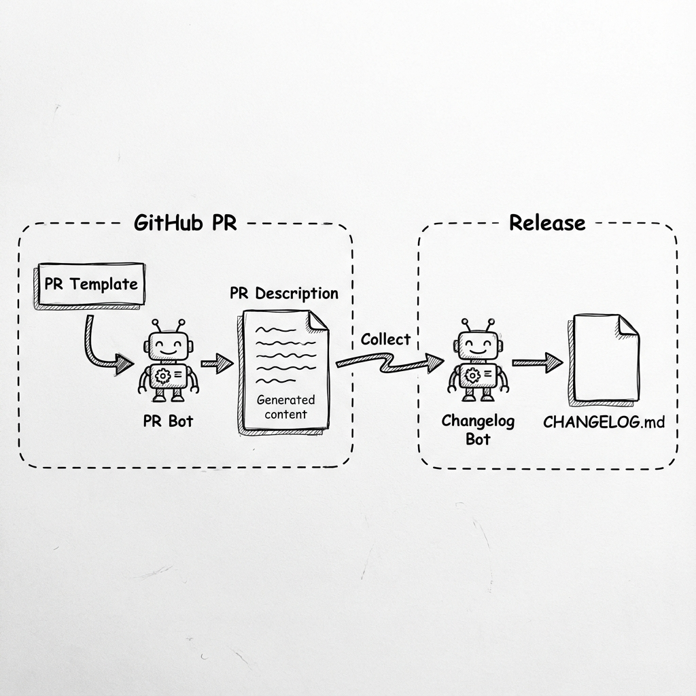
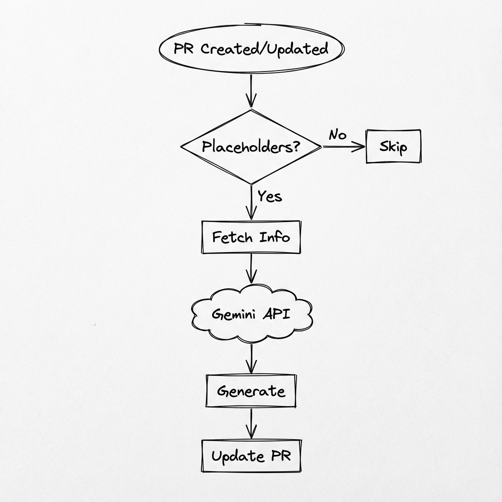
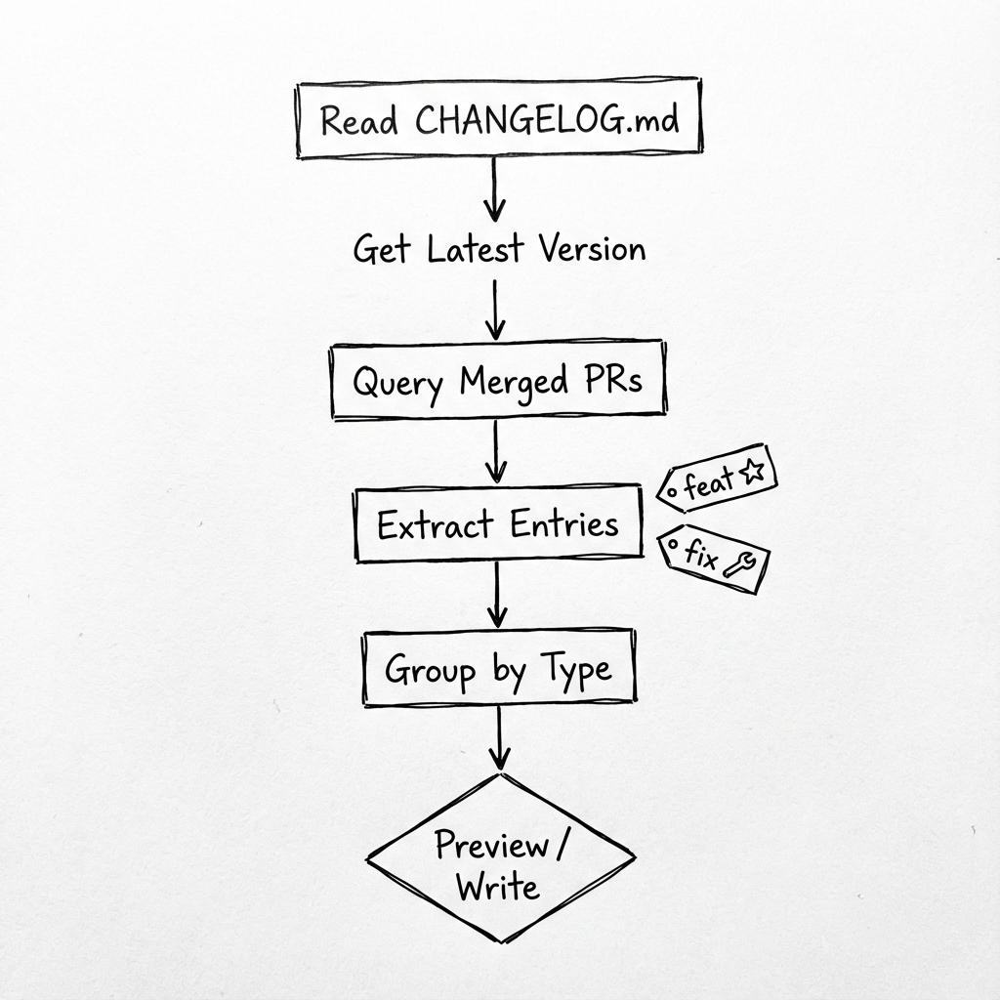
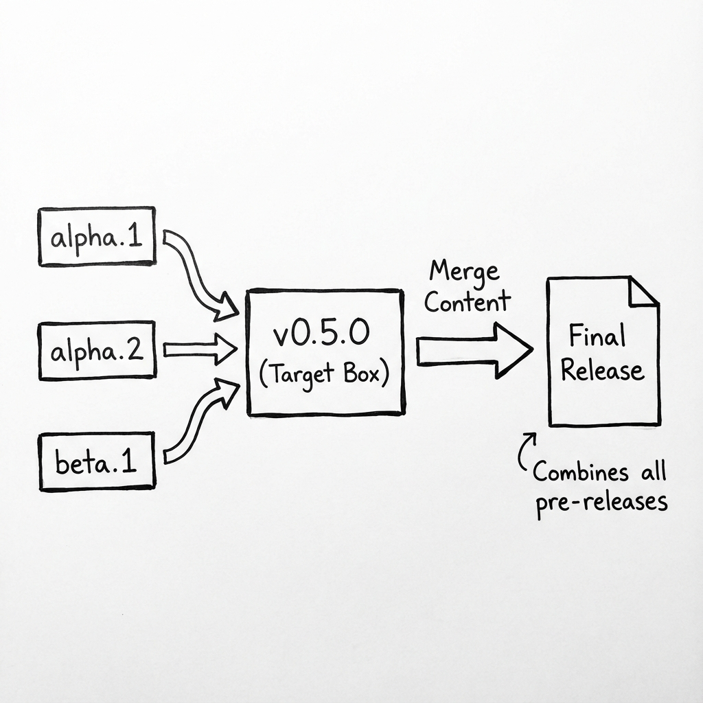

# Changelog Management System

This document describes the automated changelog management system for the Ribir project. The system consists of three components working together:



---

## Component Overview

| Component | File | Purpose |
|-----------|------|---------|
| PR Template | [pull_request_template.md](../.github/pull_request_template.md) | Defines PR description format with changelog placeholders |
| PR Bot | [pr-bot.rs](../tools/pr-bot.rs) | AI-powered summary and changelog generation |
| Changelog Bot | [changelog-bot.rs](../tools/changelog-bot.rs) | Collects entries and updates CHANGELOG.md |

> **Tip:** Run `cargo +nightly -Zscript tools/pr-bot.rs --help` or `cargo +nightly -Zscript tools/changelog-bot.rs --help` for detailed usage instructions.

---

## 1. PR Template

### Purpose

Provides a standardized description template for every Pull Request:
- Contributors provide necessary context
- Changelog entries follow a unified format
- AI Bot can recognize placeholders and auto-generate content

### Key Markers

```markdown
<!-- RIBIR_CHANGELOG_START -->
...changelog entries...
<!-- RIBIR_CHANGELOG_END -->
```

These markers are used by:
1. PR Bot to identify the generation area
2. Changelog Bot to extract entries during release

### Changelog Entry Format

Follows [Conventional Commits](https://www.conventionalcommits.org/) specification:

```
- type(scope): description
```

**Types:**
| Type | Description |
|------|-------------|
| `feat` | New feature |
| `fix` | Bug fix |
| `change` | Modification to existing functionality |
| `perf` | Performance improvement |
| `docs` | Documentation update |
| `breaking` | Breaking change |

**Scopes:**
`core` | `gpu` | `macros` | `widgets` | `themes` | `painter` | `cli` | `text` | `tools`

### Skipping Changelog

For changes that don't need recording (tests, CI configs), check:
```markdown
- [x] 🔧 Skip changelog
```

---

## 2. PR Bot

### Purpose

Uses Gemini AI to automatically generate:
1. **PR Summary** - Concise change summary (1-3 sentences)
2. **Changelog Entries** - Conventional format entries

### GitHub Actions Integration

PR Bot is triggered via comment commands:

```
@pr-bot regenerate [context]  # Regenerate summary and changelog
@pr-bot summary [context]     # Regenerate only summary
@pr-bot changelog [context]   # Regenerate only changelog
@pr-bot help                  # Show all commands
```

`[context]` is optional additional context to help AI understand the changes better.

### Workflow



### Requirements

- Rust nightly (for `-Zscript`)
- `gh` CLI (authenticated)
- `gemini` CLI
- `GEMINI_API_KEY` environment variable

---

## 3. Changelog Bot

### Purpose

Manages `CHANGELOG.md` file:
1. **collect** - Collect entries from merged PRs and create new release
2. **merge** - Merge pre-release versions into final release
3. **verify** - Verify changelog parsing logic

### Collect Command Flow



### Merge Command Flow

Merges pre-releases (e.g., `0.5.0-alpha.1`, `0.5.0-beta.2`) into final release (`0.5.0`):



### Section Mapping

PR types map to CHANGELOG.md sections:

| PR Type | CHANGELOG Section |
|---------|-------------------|
| `feat`, `feature` | 🎨 Features |
| `fix`, `fixed` | 🐛 Fixed |
| `change`, `changed` | 🔄 Changed |
| `perf`, `performance` | ⚡ Performance |
| `docs`, `doc` | 📚 Documentation |
| `breaking`, `break` | 💥 Breaking |
| `internal`, `chore`, `refactor` | 🔧 Internal |

---

## Complete Workflow Example

### Daily Development Flow

1. **Create PR** - Use PR Template
2. **AI Generates Content** - If placeholders are kept, PR Bot auto-generates
3. **Manual Adjustments** - Edit generated content, or use `@pr-bot` commands to regenerate
4. **Merge PR** - Changelog entries remain in PR description

### Release Flow

1. **Collect Entries**
   ```bash
   cargo +nightly -Zscript tools/changelog-bot.rs collect --version 0.5.0-alpha.1 --write
   ```

2. **Pre-releases (if needed)** - Repeat above step

3. **Merge into Final Version**
   ```bash
   cargo +nightly -Zscript tools/changelog-bot.rs merge --version 0.5.0 --write
   ```

4. **Create Release** - Use the updated CHANGELOG.md

---

## Troubleshooting

### PR Bot Not Triggered

- Confirm PR description contains placeholder text
- Check GitHub Actions logs
- Ensure `GEMINI_API_KEY` secret is configured

### Changelog Bot Can't Find PRs

- Confirm target version tag exists
- Check if PRs were merged to `master` branch
- Verify `gh` CLI is properly authenticated

### Generated Content Inaccurate

Use command with context to regenerate:
```
@pr-bot regenerate This PR mainly refactors the rendering pipeline for better performance
```

---

## Related Files

- [CHANGELOG.md](../CHANGELOG.md) - Project changelog
- [CONTRIBUTING.md](../CONTRIBUTING.md) - Contribution guide
- [RELEASE.md](../RELEASE.md) - Release process guide
